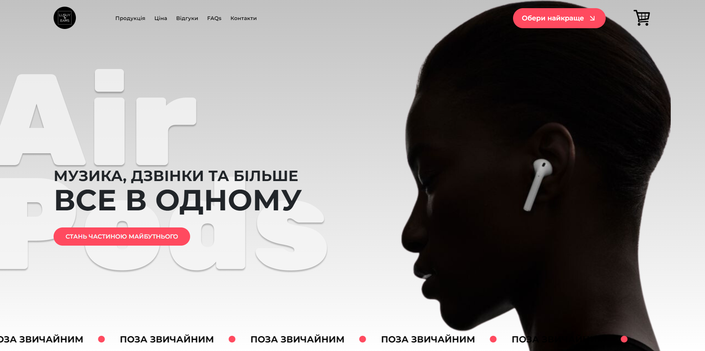
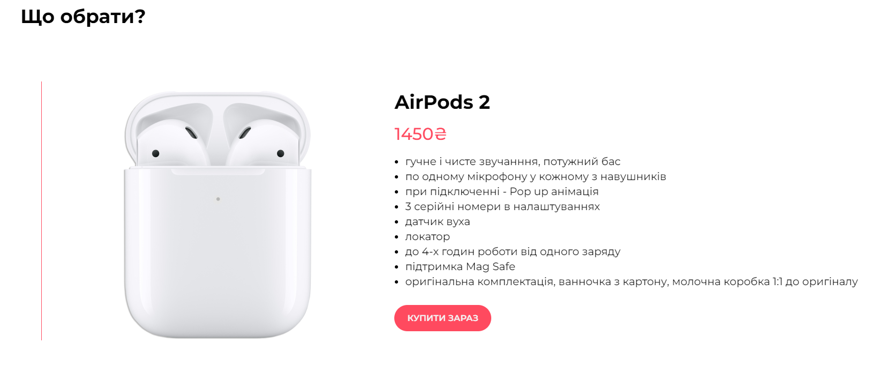
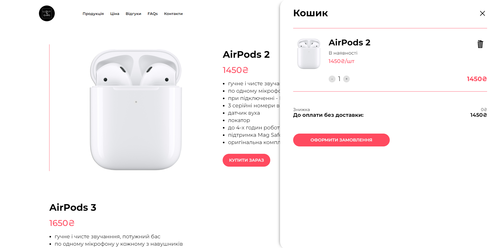
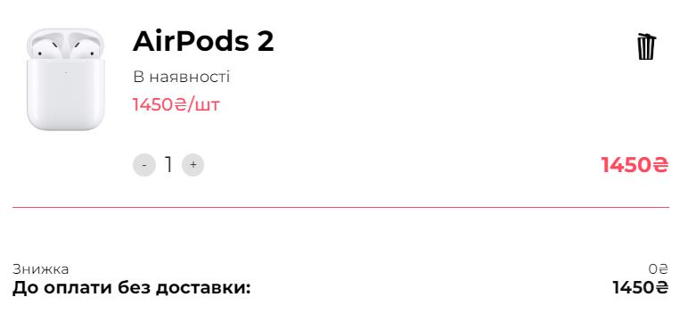
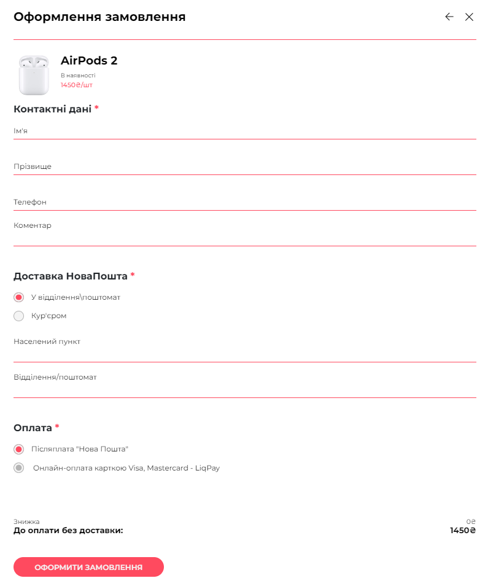

# Lusuy Ears (real order)

[Here you can check it](https://lusuyears.com.ua/)

---

I had figma design for this project.
Also this was the first project where I had to buy own hosting and publish website there.
Actually this landing page is a small shop where everything created with my own JavaScript code.
This landing page is 100% responsive for all types of screens.
I used HTML, CSS, JS in this project.

---

### What was interesting in this project:

1. Interesting view of main section.



2. Items in the list has their own buttons "buy it now", item automatically adding to cart and cart is opening.



3. Open cart view



4. Cart item view. Plus and minus adding or removing more items in cart, price and total price automatically chaning as well. Also there is a delete button which removes full item from cart.



5. Amazing custom created form. Post information automatically taking info from Nova Poshta API and appearing in datalist. Also there is Liqpay payment active as well.



```
  const url = 'https://api.novaposhta.ua/v2.0/json/';
    fetch(url, options)
      .then((response) => response.json())
      .then((res) => {
        console.log(res);
        for (let i = 0; i < res.data[0].Addresses.length; i++) {
          if (citySelect.value == res.data[0].Addresses[i].Present) {
            delivery = res.data[0].Addresses[i].DeliveryCity;
            console.log(delivery);
            return false;
          } else {
            cityFinalList.push(res.data[0].Addresses[i].Present);
          }
        }
      })
```
